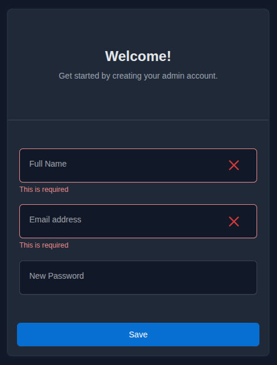

# Dugout quick start

This guide sets up Dugout's shared local services and containerized command
tools on a development machine.

## Prerequisites

- Docker Engine with the Compose plugin
- Git
- A POSIX shell (`sh`)
- `make`

## 1. Configure Dugout

```sh
git clone https://github.com/mozrin/dugout.git
cd dugout
cp .env.example .env
```

Open `.env` and replace the default MinIO credentials:

```dotenv
DUGOUT_MINIO_ROOT_USER=your-local-admin
DUGOUT_MINIO_ROOT_PASSWORD=your-long-local-password
```

After starting Nginx Proxy Manager for the first time, complete its admin setup
at [http://localhost:81](http://localhost:81), then add the resulting
credentials to `.env`:

```dotenv
DUGOUT_NPM_EMAIL=you@example.com
DUGOUT_NPM_PASSWORD=your-npm-admin-password
```

The local `.env` is ignored by Git. See the
[configuration reference](docs/09-configuration-reference.md) for all
supported settings.

## 2. Start the shared services

```sh
make services-up
```

This creates the shared `moznet` Docker network automatically and starts
Nginx Proxy Manager, Portainer, Adminer, Mailpit, Dozzle, and MinIO.

Only host ports `80` and `81` are published. After creating the Nginx Proxy
Manager account shown above, seed the standard proxy hosts:



```sh
make services-seed
```

The command creates any missing entries from this list and preserves entries
that already exist:

| Local hostname | Forward host | Forward port |
| --- | --- | ---: |
| `proxy.localhost` | `do_proxy` | 81 |
| `portainer.localhost` | `do_portainer` | 9000 |
| `adminer.localhost` | `do_adminer` | 8080 |
| `mailpit.localhost` | `do_mailpit` | 8025 |
| `dozzle.localhost` | `do_dozzle` | 8080 |
| `minio.localhost` | `do_minio` | 9001 |
| `s3.localhost` | `do_minio` | 9000 |

The seed uses HTTP with SSL disabled and enables WebSocket support for Dozzle
and MinIO. Application containers on `moznet` can use `mailpit:1025` for SMTP
and `http://minio:9000` for S3-compatible storage.

## 3. Build and install the command tools

```sh
make build-tools
make install
export PATH="$HOME/.local/bin:$PATH"
```

Persist the `PATH` line in your shell profile if desired.

## 4. Verify the installation

```sh
dug version
dug doctor
php --version
composer --version
node --version
npm --version
dart --version
flutter --version
```

The release command should report:

```text
dug 1.1.0 (Double)
```

## Everyday commands

```sh
make services-up       # create moznet if needed and start services
make services-seed     # create missing Nginx Proxy Manager hosts
make services-stop     # stop services but retain moznet and data
make services-restart  # restart the service containers
make services-status   # show container status
make test              # run repository validation
```

To use Dugout's command tools from another repository, continue with the
[new-project integration guide](docs/10-new-project-quickstart.md).
