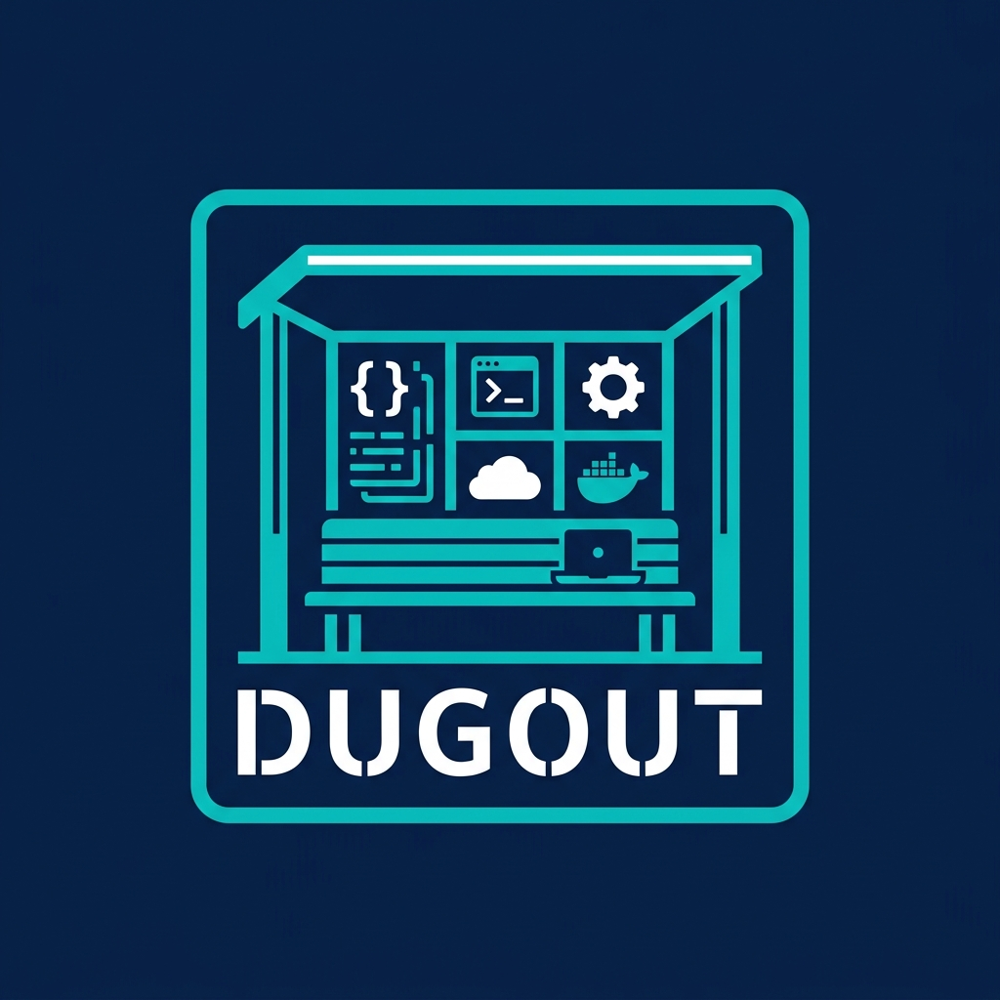

<p align="left">
  
</p>

# Dugout

Containerized development tools. No installers, no version managers, no host
pollution — just Docker.

When you run `npm install`, Dugout spins up a disposable container with the
right Node version, mounts your project, runs the command, and disappears.
Nothing is installed on your machine except a few tiny shell scripts.

---

## Install

```sh
curl -fsSL https://raw.githubusercontent.com/moztopia/dugout/main/.docker/install.sh | sh
```

Make sure `~/.local/bin/dugout` is in your `PATH`. Add this to your shell
config if it isn't already:

```sh
export PATH="$HOME/.local/bin/dugout:$PATH"
```

Open a new terminal and verify:

```sh
node --version
npm --version
npx --version
```

## Uninstall

Remove the shims:

```sh
rm -rf ~/.local/bin/dugout
```

Optionally remove the cached Docker images:

```sh
docker rmi ghcr.io/moztopia/dugout-node:22 ghcr.io/moztopia/dugout-node:24 ghcr.io/moztopia/dugout-node:26
```

That's everything. No config files, no daemons, no leftover state.

---

## Supported Tools

| Tool | Command | Image |
| --- | --- | --- |
| Node.js | `node` | `ghcr.io/moztopia/dugout-node` |
| npm | `npm` | `ghcr.io/moztopia/dugout-node` |
| npx | `npx` | `ghcr.io/moztopia/dugout-node` |

All three share the same image. npm and npx are bundled with Node.

## Switching Versions

Set `DUGOUT_NODE_VERSION` to change which Node version runs:

```sh
export DUGOUT_NODE_VERSION=22
```

| Version | Status |
| --- | --- |
| 22 | Supported |
| **24** | **Default** |
| 26 | Supported |

The version can be set globally in your shell config, per-session, or
per-command:

```sh
# Global default (add to ~/.bashrc or ~/.bash_pathing)
export DUGOUT_NODE_VERSION=26

# One-off command
DUGOUT_NODE_VERSION=22 node --version
```

---

## How It Works

Each command in `~/.local/bin/dugout/` is a ~10 line shell script that calls
`docker run` with the right image and mounts your current directory:

```bash
      you: npm install
     shim: docker run --rm ghcr.io/moztopia/dugout-node:24 npm install
   result: node_modules/ created in your project directory
```

The container runs as your user (same UID/GID), so files it creates are owned
by you. The container is removed immediately after the command finishes.

## Requirements

- Docker

---

## Repository Structure

```tree
.docker/
  images/node.Dockerfile    Image recipe for Node 22/24/26
  installer.Dockerfile      Installer image
  install.sh                Curl installer
bin/
  node                      Shim — runs node in a container
  npm                       Shim — runs npm in a container
  npx                       Shim — runs npx in a container
tools/
  barrel/                   Barrel — file scaffolding tool
```

## For Maintainers

Build images:

```sh
for v in 22 24 26; do
  docker build --build-arg NODE_VERSION=$v -f .docker/images/node.Dockerfile -t ghcr.io/moztopia/dugout-node:$v .
done
```

Push to GHCR:

```sh
echo $GH_DUGOUT_WRITE_PACKAGES | docker login ghcr.io -u moztopia --password-stdin
for v in 22 24 26; do docker push ghcr.io/moztopia/dugout-node:$v; done
```
