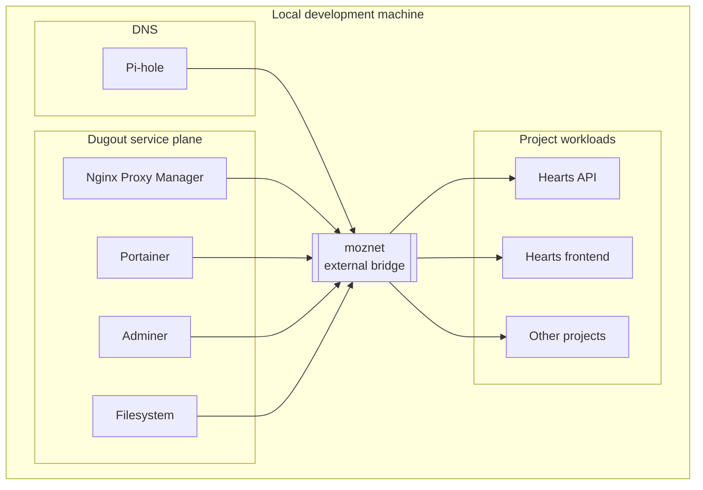
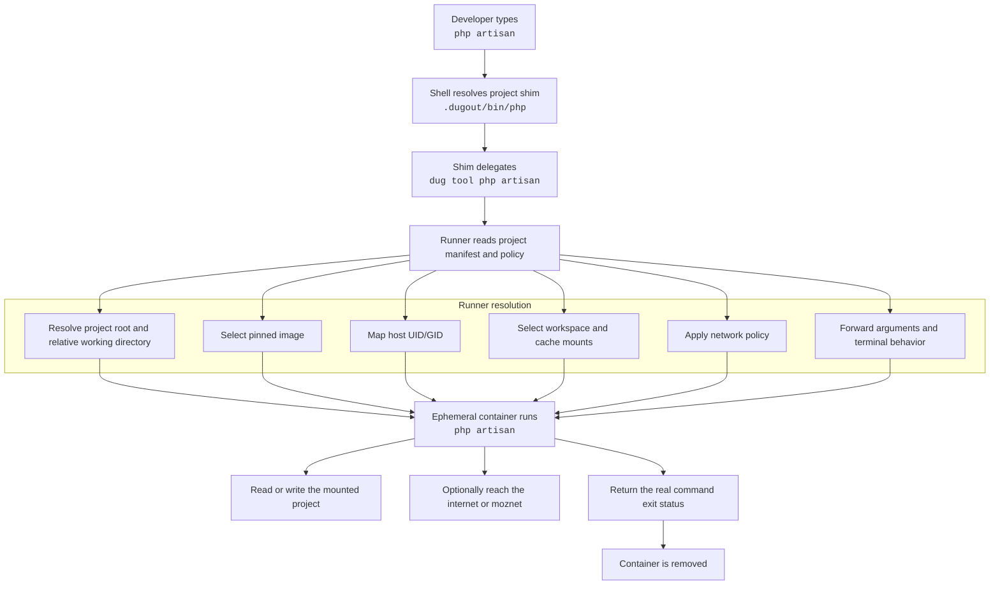
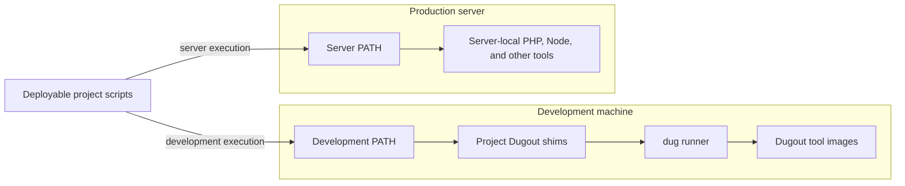

# Platform architecture

## Status

The Dugout service plane exists today. The tool plane described below is a
proposed extension.

## Existing service plane

Dugout provides shared infrastructure for local development:

- Nginx Proxy Manager for name-based routing;
- Portainer for container administration;
- Adminer for database administration;
- Filesystem for browser-based file management;
- Pi-hole or another DNS layer for local name resolution;
- the external Docker network named `moznet`.

Application repositories remain separate Compose projects. During local
development, each project's `docker-compose.override.yaml` connects selected
application services to `moznet`.



Application services do not publish development ports. Shared routing is
centralized at Dugout's edge.

## Ownership boundaries

### Dugout owns

- creation and lifecycle documentation for `moznet`;
- shared DNS and reverse-proxy behavior;
- long-running administration services;
- source definitions and publication of tool images;
- the shared runner contract;
- tool security defaults;
- image metadata and release policy.

### Each project owns

- its application services;
- which application services connect to `moznet`;
- selected tool versions;
- project-local command shims;
- tool-specific environment values;
- editor and workspace configuration;
- project dependencies such as PHPUnit, Pint, ESLint, or Vitest;
- compatibility between tool images and application runtime images.

### The developer owns

- starting Dugout;
- installing and running Docker;
- choosing whether project shims are active outside the editor;
- authenticating registry and external-service clients;
- approving access to credentials, devices, or the Docker socket.

### Production provisioning owns

- server-local language runtimes and command-line tools;
- production runtime versions and extensions;
- the production `PATH`;
- deployment artifact contents;
- production networks, which are unrelated to `moznet`;
- verification that deployed scripts have no Dugout dependency.

## Proposed tool plane

The tool plane adds independent, short-lived command containers:



The service and tool planes share Docker as an execution substrate, but their
lifecycle is deliberately different:

| Concern | Service plane | Tool plane |
| --- | --- | --- |
| Lifetime | Long-running | One command |
| Managed by | Docker Compose | Shared runner |
| Restart policy | Usually `unless-stopped` | Never |
| Published ports | Only centralized edge infrastructure | Never |
| `moznet` | Normal for shared services | Explicit and exceptional |
| Workspace mount | Usually none | Project root |
| Host UID/GID | Service-specific | Required for writable project files |
| Version selection | Dugout Compose | Project tool manifest |
| State | Named volumes and config | Project files and explicit caches only |

## Why the tool plane is not a devcontainer

A devcontainer is a complete editor-facing workspace environment. The proposed
tool plane instead virtualizes individual commands.

That distinction provides several benefits:

- the host editor remains usable;
- commands do not depend on VS Code;
- CI can execute the same images;
- PHP and Node versions can be selected per project;
- a failing tool container does not invalidate the whole workspace;
- tool upgrades are independent;
- no permanent workspace container is required;
- the Docker socket is not mounted into a general-purpose development shell.

A devcontainer can remain an optional client. If used, its terminal should
resolve the same project shims and call the same runner contract. It must not
contain the only working copy of the toolchain.

## Deployment boundary

Dugout exists on development machines only. It is not installed, copied,
started, or activated on a production server.



The same deployable script may use:

```sh
php script.php
```

or:

```text
#!/usr/bin/env php
```

During development, `PATH` selects `.dugout/bin/php`. On the server, the shim
directory is absent from `PATH`, so the server's locally provisioned `php`
binary is selected.

Deployable scripts must not call:

```sh
dug tool php script.php
```

and must not hard-code `.dugout/bin/php`. Those forms create a production
dependency on a development-only platform.

Deployment packaging should exclude development integration such as:

```text
.dugout/
.vscode/
*.code-workspace
```

If a source-based deployment cannot exclude committed metadata, it must remain
inert: `dug` is not installed, `.dugout/bin` is not added to `PATH`, and no
production process references it. The preferred design is to omit it from the
artifact entirely.

## `moznet` lifecycle

`moznet` is external to application Compose projects. Docker Compose treats an
external network as infrastructure whose lifecycle is managed elsewhere and
fails when that network does not exist.

The tool runner must follow the same ownership rule:

- it may inspect `moznet`;
- it may attach an explicitly authorized tool container to `moznet`;
- it must not create `moznet` as a side effect of running a tool;
- it must emit a clear message telling the developer to start or repair
  Dugout when `moznet` is required but unavailable.

This keeps failures visible and prevents an accidentally created, incorrectly
configured network from impersonating the real platform network.

## Architectural invariants

The implementation must preserve these invariants:

1. Tool containers never publish host ports.
2. No ordinary tool receives the Docker socket.
3. A project command never silently falls back to a host binary.
4. A tool receives only the workspace and resources declared by policy.
5. Project files created by a tool are writable by the host user.
6. The tool's exit code becomes the shim's exit code.
7. Arguments are forwarded without reparsing or `eval`.
8. Running from a project subdirectory preserves that relative directory.
9. `moznet` access is explicit.
10. Version selection is committed and reviewable.
11. Mutable tags are optional conveniences, not reproducibility guarantees.
12. Essential project behavior works without VS Code.
13. Dugout is absent from production servers.
14. Deployable scripts never invoke `dug` or `.dugout/bin/*` directly.
15. The server resolves ordinary commands through its independently managed
    `PATH`.

## Source references

- [Docker run reference](https://docs.docker.com/reference/cli/docker/container/run/)
- [Docker Compose external networks](https://docs.docker.com/reference/compose-file/networks/#external)
- [VS Code variables reference](https://code.visualstudio.com/docs/reference/variables-reference)
