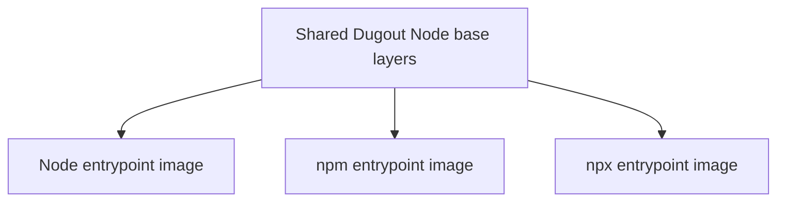

# Tool image contract

## Purpose

This document defines the contract for every Dugout tool image. A tool can
have unavoidable runtime dependencies, but it exposes one public command and
one reason to exist.

Examples:

- the PHP image exposes `php`;
- the Composer image exposes `composer`, even though Composer requires PHP;
- the npm image exposes `npm`, even though npm requires Node.js;
- the npx image exposes `npx`, even though npx requires Node.js and npm
  internals;
- the Dart image exposes `dart`;
- the Flutter image exposes `flutter` and contains only command-line Android
  build dependencies;
- the ShellCheck image exposes `shellcheck`.

“One image, one tool” describes the public interface. It does not require
duplicating every base layer or pretending dependency runtimes do not exist.

## Naming

The final registry is an implementation decision. Documentation and examples
use this shape:

```text
<registry>/moztopia/dugout-<tool>:<tool-version>
```

Examples:

```text
ghcr.io/moztopia/dugout-php:8.4
ghcr.io/moztopia/dugout-composer:2.8
ghcr.io/moztopia/dugout-node:24
ghcr.io/moztopia/dugout-shellcheck:0.11.0
```

Projects should be able to override the registry without rewriting every shim.
The image basename and version remain project-owned configuration.

## Required image behavior

Every tool image must:

1. define the tool as its exec-form `ENTRYPOINT`;
2. forward all supplied arguments directly to the tool;
3. return the tool's real exit code;
4. write ordinary output to standard output;
5. write diagnostics to standard error;
6. accept standard input when the tool supports it;
7. behave correctly with and without a TTY;
8. use `/workspace` as the conventional working directory;
9. work when launched with a numeric `UID:GID` not present in `/etc/passwd`;
10. avoid requiring root at runtime;
11. avoid daemonizing or starting background services;
12. contain no `EXPOSE` instruction unless the tool contract explicitly
    requires a listener—and Dugout's initial tool catalog requires none;
13. support `--version` or the tool's closest equivalent;
14. include OCI metadata identifying source, license, revision, and version;
15. use deterministic package installation and pinned upstream versions;
16. include an architecture declaration and published platform support;
17. tolerate a read-only root filesystem when practical;
18. treat `/tmp` and declared cache paths as disposable;
19. contain no project credentials or developer-specific configuration;
20. have a contract test proving the behavior above.

## Dockerfile shape

A small standalone tool may resemble:

```dockerfile
FROM alpine:3.22

ARG TOOL_VERSION

RUN apk add --no-cache example-tool="${TOOL_VERSION}-r0"

WORKDIR /workspace
ENTRYPOINT ["example-tool"]
CMD ["--help"]
```

This is illustrative, not a universal mandate. A language tool must use a base
compatible with the project artifacts it creates.

## Entrypoint rules

Use the exec form:

```dockerfile
ENTRYPOINT ["php"]
```

Do not use a shell-form entrypoint:

```dockerfile
ENTRYPOINT php
```

Do not wrap simple tools in a shell unless the wrapper performs necessary,
tested setup. Exec-form entrypoints preserve argument boundaries and signal
delivery.

The runner invokes:

```sh
docker run IMAGE argument-one "argument two"
```

The resulting process must be equivalent to:

```sh
tool argument-one "argument two"
```

No image entrypoint may use `eval`, concatenate arguments into a command
string, or invoke an interactive shell merely to locate the tool.

## Base-image policy

Small size is a goal, not the sole selection criterion.

Use Alpine when:

- the tool is statically compiled or known to support musl;
- it does not generate native dependencies consumed by a glibc runtime;
- upstream publishes and tests Alpine-compatible artifacts;
- debugging costs remain reasonable.

Use Debian or Ubuntu slim when:

- artifacts must match a Debian/glibc application runtime;
- upstream binary releases assume glibc;
- PHP extensions or Node native modules need runtime parity;
- Alpine would require compatibility layers or source compilation;
- the “smaller” image would be operationally less predictable.

Do not mix libc families casually. For example, `npm install` in an Alpine tool
container can produce native modules that fail in a Debian-based application
container.

## Runtime-family compatibility

### PHP and Composer

Composer evaluates the PHP version and extensions available inside its own
container. A generic Composer image can therefore accept a dependency set that
the project's API container cannot run—or reject one the API can run.

Projects must choose one of these strategies:

1. use a Composer image built from the same PHP base and extension set as the
   project runtime;
2. configure Composer's platform requirements deliberately;
3. run Composer through the project API image when exact parity is essential.

The runner must not claim that all Composer images are interchangeable.

### Node, npm, and npx

The Node version, architecture, libc, and native build toolchain can affect
`node_modules`. The `node`, `npm`, and `npx` images selected by a project must
belong to the same runtime family as the project's application image.

Separate public images may share the same internal base:



This preserves the one-command interface without paying the full build and
registry cost three times.

### Dart and Flutter

The implemented Dart image uses the official pinned Dart SDK image. The
implemented Flutter image is a deliberate heavyweight exception: it uses the
official pinned Flutter SDK archive plus the Android command-line SDK,
platform, build tools, and Flutter's pinned Android NDK and CMake. It does not
contain Android Studio, an emulator, or device access.

The image supports `flutter pub`, `flutter analyze`, `flutter test`, and
`flutter build`. Its entrypoint rejects `flutter run`; interactive emulator
and physical-device workflows require a host Flutter installation and
explicit device access. Flutter writes SDK-internal metadata during normal
commands, so its unprivileged, ephemeral container is the documented
read-only-root exception. The writable container layer is discarded at exit.

## Runtime user and filesystem

The runner will normally supply:

```text
--user <host-uid>:<host-gid>
```

Images must therefore:

- not assume a named user exists;
- not require writes to `/root`;
- respect `HOME` supplied by the runner;
- write generated project files through the workspace bind mount;
- put disposable data under `/tmp`;
- put reusable downloads under a documented cache directory.

Recommended conventional paths:

| Purpose | Path |
| --- | --- |
| Project | `/workspace` |
| Temporary home | `/tmp/dugout-home` |
| Temporary files | `/tmp` |
| Tool cache | `/cache` |

If a tool requires a passwd entry, the requirement must be documented and
solved in the image without running the main command as root.

## Caches

Images declare a cache path; they do not decide what host volume backs it.

Examples:

| Tool | Suggested internal cache |
| --- | --- |
| Composer | `/cache/composer` |
| npm/npx | `/cache/npm` |
| Dart | Versioned host cache mounted at the same absolute path (`PUB_CACHE`) |
| Flutter | Same-path host mounts for its pub and Gradle caches |
| OpenAPI Generator | `/cache/openapi-generator` |

The runner may mount a named volume or project-scoped host cache at `/cache`.
Cache contents must never be required for correctness and must be safe to
delete.

Avoid sharing one unversioned cache between incompatible major runtime
families. Cache keys should include at least tool name, major version,
architecture, and relevant libc/runtime family.

## Network declaration

Every image receives one declared default policy:

- `none`: no network required;
- `internet`: normal Docker egress required;
- `moznet`: access to local development services required;
- `docker`: access to the Docker API required;
- `explicit`: no default; the caller must choose.

The image itself does not attach networks. The runner enforces policy.

Suggested defaults:

| Tool | Default |
| --- | --- |
| PHP | `none` |
| Composer | `internet` |
| Node | `none` |
| npm | `internet` |
| npx | `internet` |
| Dart | `internet` |
| Flutter | `internet` |
| ShellCheck | `none` |
| MariaDB client | `moznet` |
| Redis CLI | `moznet` |
| Docker CLI | `docker` |

## Version and provenance

Each published image should carry:

- the upstream tool version;
- the Dugout image revision;
- the source commit;
- the build timestamp;
- the source repository URL;
- the license;
- the supported platform list;
- an immutable digest.

Recommended tag families:

```text
8.4.12          exact upstream version
8.4             moving minor channel
8               moving major channel
sha-<commit>    Dugout source revision
```

Projects use exact versions or digests. Moving tags are for exploration and
human convenience.

## Image review checklist

- [ ] One public command
- [ ] Exec-form entrypoint
- [ ] Upstream version pinned
- [ ] Base image pinned by digest in the build definition
- [ ] No runtime root requirement
- [ ] Numeric UID/GID works
- [ ] `/workspace` behavior tested
- [ ] Standard input tested
- [ ] TTY and non-TTY output tested
- [ ] Exit-code forwarding tested
- [ ] No ports exposed
- [ ] No credentials embedded
- [ ] Network policy declared
- [ ] Cache path declared
- [ ] OCI metadata present
- [ ] Supported architectures published
- [ ] Vulnerability scan reviewed
- [ ] Compatibility caveats documented
