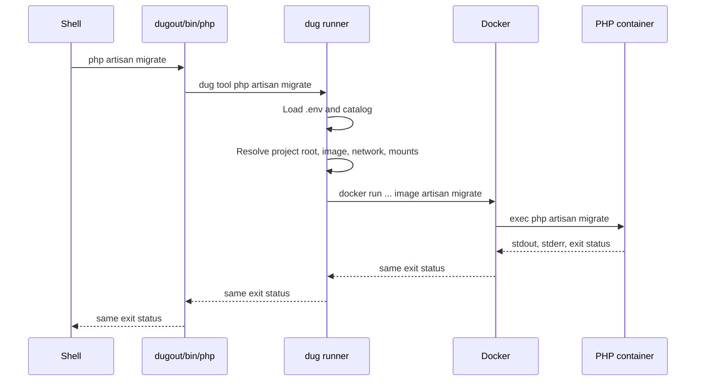

# Runner and command shims

## Goal

In a VS Code terminal opened from an activated project workspace:

```sh
php artisan migrate
```

runs the configured Dugout PHP image, even if the host has another `php`
installed. The host installation remains untouched and becomes visible again
outside the activated terminal.

## Components and ownership

```text
dugout/
├── .env                 # local machine values; ignored
├── .env.example         # committed configuration contract
├── bin/
│   ├── dug              # shared runner
│   ├── php              # POSIX shims
│   ├── composer
│   ├── node
│   ├── npm
│   ├── npx
│   ├── dart
│   └── flutter
└── share/dugout/catalog # trusted tool policy
```

All executable interception lives in Dugout. Application projects do not copy
the shims or runner.

## POSIX shim contract

The PHP shim is representative:

```sh
#!/bin/sh
set -eu

exec "$(CDPATH='' cd "$(dirname "$0")" && pwd)/dug" tool php "$@"
```

Every shim:

- uses `#!/bin/sh`, not Python or Bash;
- finds `dug` beside itself, so no global runner installation is required;
- forwards arguments as `"$@"`, preserving spaces and argument boundaries;
- uses `exec`, preserving signals and the final exit status;
- contains no image, version, network, or Docker policy;
- fails when Dugout cannot run and never calls a host tool as fallback.

This makes aliases unnecessary. Real executables in `PATH` also work in
non-interactive shells, child processes, Make recipes, and ordinary shell
scripts.

## Resolution flow



## Configuration precedence

The runner determines values in this order, from highest to lowest priority:

1. an exported process environment value such as
   `DUGOUT_NODE_VERSION=24`;
2. the file named by `DUGOUT_CONFIG`;
3. Dugout's root `.env` when running from the source checkout;
4. `~/.config/dugout/.env` for an installed runner;
5. built-in safe defaults.

The configuration parser accepts documented `KEY=value` records only. It does
not `source`, `eval`, interpolate, or execute `.env`. See the complete
[configuration reference](09-configuration-reference.md).

## Project root discovery

The runner must expose only the current project, not all sibling repositories.
It resolves the root in this order:

1. `DUGOUT_PROJECT_ROOT`, when explicitly configured;
2. the nearest ancestor containing `.dugout/tool-versions`;
3. `git rev-parse --show-toplevel`;
4. the current directory when no Git project exists.

The current directory must be the root or below it. Paths containing commas
are rejected because Docker's structured mount syntax uses commas as
separators.

Example:

```text
host root:       /home/developer/Code/hearts
host cwd:        /home/developer/Code/hearts/frontend/src
container root:  /workspace
container cwd:   /workspace/frontend/src
```

## Image selection

Without a project manifest, tags derive from the machine configuration:

| Command | Default image |
| --- | --- |
| `php` | `moztopia/dugout-php:8.4` |
| `composer` | `moztopia/dugout-composer:2-php84` |
| `node` | `moztopia/dugout-node:22` |
| `npm` | `moztopia/dugout-npm:10-node22` |
| `npx` | `moztopia/dugout-npx:10-node22` |
| `dart` | `moztopia/dugout-dart:3.12.2` |
| `flutter` | `moztopia/dugout-flutter:3.44.2` |

The prefix and component versions are configurable. Composer's tag includes
the selected PHP line; npm and npx tags include the Node.js line. This prevents
an apparently harmless package-manager upgrade from silently changing its
runtime.

An application may optionally commit:

```text
# .dugout/tool-versions
php 8.4
composer 2-php84
node 22
npm 10-node22
npx 10-node22
dart 3.12.2
flutter 3.44.2
```

The manifest contains image tags, not shell code. Blank lines and comments are
allowed; duplicates, malformed rows, missing requested tools, and unsafe tag
characters fail closed. It is optional: Hearts does not need one for the
machine-default configuration.

## Container invocation

The runner constructs an argument vector equivalent to:

```sh
docker run \
  --rm \
  --init \
  --interactive \
  --read-only \
  --label "dev.moztopia.dugout.tool=php" \
  --user "<uid>:<gid>" \
  --workdir "/workspace/<relative-directory>" \
  --mount "type=bind,src=<project-root>,dst=/workspace" \
  --tmpfs "/tmp:rw,nosuid,nodev,exec" \
  --env "HOME=/tmp/dugout-home" \
  --security-opt "no-new-privileges=true" \
  --cap-drop "ALL" \
  --network "<policy-selected-network>" \
  "moztopia/dugout-php:8.4" \
  "$@"
```

Flutter is the sole root-filesystem exception: the SDK updates internal
metadata during normal commands. Its container layer is writable but remains
unprivileged, capability-free, unpublished, and disposable under `--rm`.
After a Flutter command, the runner restores host-readable SDK paths in the
generated `.dart_tool/package_config.json`. Dart and Flutter caches are
mounted at the same absolute path on the host and in the container so editor
analysis does not inherit inaccessible `/cache` paths.

The implementation does not build a shell string and does not use `eval`.
When both input and output are terminals it adds `--tty`. Non-interactive
calls keep stdin attached without forcing terminal formatting.

## Mounts and file ownership

- The resolved project root is mounted once at `/workspace`.
- The nested working directory is preserved.
- Writable tools see a writable project mount.
- The container uses the caller's numeric UID and GID.
- The image root filesystem is read-only except for Flutter's disposable
  SDK-metadata layer.
- `/tmp` is a disposable tmpfs and provides a writable temporary `HOME`.
- Composer, npm/npx, Dart, and Flutter receive only their explicit Dugout
  cache directories.
- The host home directory and Docker socket are not mounted.

These rules prevent root-owned generated files while containing writes to the
project, declared caches, and temporary storage.

## Networks

The committed catalog defines baseline policy and `.env` can choose one of:

| Value | Meaning |
| --- | --- |
| `none` | No container network |
| `bridge` | Docker's ordinary bridge; useful for package downloads |
| `moznet` | Dugout's managed, globally named development network |

The runner never creates `moznet`; `make services-up` does. A tool configured
for `moznet` fails with a clear error if the network is absent. No invocation
adds `--publish`, `--privileged`, or the Docker socket.

The current defaults are:

| Tool | Network |
| --- | --- |
| PHP | `moznet` |
| Composer | `bridge` |
| Node.js | `none` |
| npm | `bridge` |
| npx | `bridge` |
| Dart | `bridge` |
| Flutter | `bridge` |

Any command can receive a one-call override:

```sh
dug --network none tool composer validate
dug --network moznet tool php artisan migrate
```

## Commands

```text
dug tool <name> [arguments...]  Run a tool
dug image <name>                Print its resolved image
dug which <name>                Print its shim and image
dug list                        List configured tools and tags
dug verify                      Check shims and local images
dug doctor                      Check Docker, moznet, and configuration
dug install                     Install runner, shims, catalog, and config
```

Examples:

```sh
dug list
dug which php
dug verify
dug doctor
```

## Script behavior

A shell script launched from an activated terminal inherits `PATH`, so this:

```sh
#!/bin/sh
set -eu

php scripts/report.php
npm --prefix frontend test
```

uses the same Dugout shims as commands typed interactively. Make recipes and
child processes follow the same rule.

Use project-relative paths for files passed to tools. An absolute host path
such as `/home/developer/Code/hearts/scripts/report.php` does not exist at that
location inside the container; the project exists at `/workspace`.

Deployable scripts must use ordinary names like `php` and `node`. They must not
invoke `dug` or a Dugout shim by path. This is what allows production to use
its own local executables.
