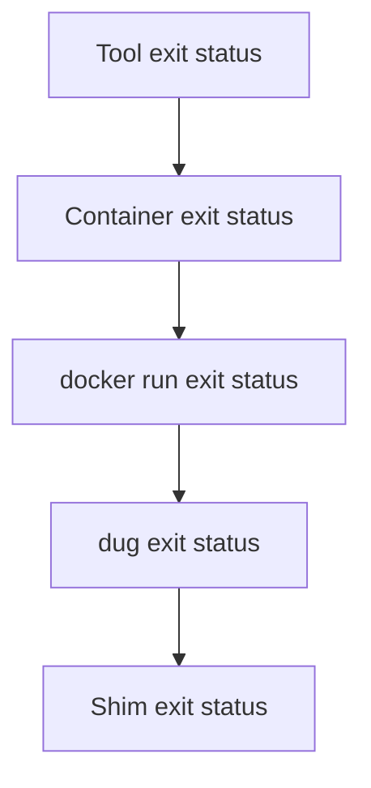

# Runner and command shims

## Goal

Inside a configured project, this:

```sh
php artisan migrate
```

must run the project-selected PHP tool image—not whichever PHP binary happens
to be installed on the host.

The proposed implementation has two layers:

1. project-local shims participate in normal shell `PATH` lookup;
2. one shared runner converts tool invocations into consistent containers.

## Proposed project layout

```text
project/
├── .dugout/
│   ├── bin/
│   │   ├── composer
│   │   ├── node
│   │   ├── npm
│   │   ├── npx
│   │   └── php
│   ├── tool-versions
│   └── tool-lock.json
├── .vscode/
│   └── settings.json
└── ...
```

`tool-lock.json` is optional in the first implementation but recommended
before Dugout promises reproducible releases.

## Shim contract

A shim is deliberately boring:

```sh
#!/bin/sh
set -eu

exec dug tool php "$@"
```

Each shim:

- is committed to the project;
- is named exactly like the command it replaces;
- uses POSIX `sh`;
- forwards arguments with `"$@"`;
- uses `exec` so signals and exit status are preserved;
- contains no version or Docker logic;
- fails if the `dug` runner is unavailable;
- never falls back to the host tool.

Silent fallback is dangerous because two developers can type the same command
and receive different dependency graphs or generated files.

## Runner location

The proposed runner executable is `dug`. It is installed once on the
development machine, for example under:

```text
~/.local/bin/dug
```

The Dugout repository owns the source and installation/update procedure.
Projects own only their shims and manifest.

A project may vendor a known runner version later, but the initial design
should avoid copying complex Docker logic into every repository.

## Tool selection

A minimal proposed `.dugout/tool-versions` format is line-oriented:

```text
php 8.4.12
composer 2.8.10
node 24.5.0
npm 11.5.1
npx 11.5.1
shellcheck 0.11.0
```

Rules:

- blank lines are ignored;
- lines beginning with `#` are comments;
- the first field is the shim/tool name;
- the second field is an exact version or approved tag;
- duplicate tool entries are an error;
- unknown fields are an error rather than silently ignored;
- the manifest is never sourced as shell code.

Not sourcing the file avoids turning a data file into arbitrary code execution.

The optional lock file maps each selection to a digest:

```json
{
  "schema": 1,
  "tools": {
    "php": {
      "image": "ghcr.io/moztopia/dugout-php:8.4.12",
      "digest": "sha256:..."
    }
  }
}
```

When a valid lock entry exists, the runner executes the digest-pinned image.

## Repository-root discovery

The runner must work from any directory inside the project:

```sh
cd frontend/src
node script.js
```

Resolution order:

1. walk upward from the current directory for `.dugout/tool-versions`;
2. optionally use `git rev-parse --show-toplevel` as a consistency check;
3. fail clearly if no Dugout project manifest is found.

The manifest location defines the workspace root. This also supports projects
that are not Git repositories and avoids accidentally selecting a parent Git
repository's tools.

The runner computes the current path relative to the workspace root:

```text
host root:       /home/developer/Code/hearts
host cwd:        /home/developer/Code/hearts/frontend/src
container root:  /workspace
container cwd:   /workspace/frontend/src
```

It then mounts the root once and passes the translated directory through
Docker's `--workdir`.

The implementation must reject:

- a current directory outside the discovered workspace;
- path traversal that escapes `/workspace`;
- a workspace root that does not exist;
- ambiguous nested manifests unless explicitly supported.

## Baseline container invocation

Conceptually, an ordinary tool becomes:

```sh
docker run \
  --rm \
  --init \
  --interactive \
  --user "<uid>:<gid>" \
  --workdir "/workspace/<relative-directory>" \
  --mount "type=bind,src=<workspace-root>,dst=/workspace" \
  --tmpfs "/tmp:rw,nosuid,nodev" \
  --env "HOME=/tmp/dugout-home" \
  --security-opt "no-new-privileges=true" \
  --cap-drop "ALL" \
  "<resolved-image>" \
  "$@"
```

This is a design sketch. The implementation must build an argument vector and
must not use `eval`.

## Standard input and TTY behavior

The runner must distinguish interaction from automation.

| Caller | Docker flags |
| --- | --- |
| Interactive stdin and terminal output | `--interactive --tty` |
| Piped stdin, non-TTY output | `--interactive` |
| No useful stdin | no interactive flag required |

Always forcing `--tty` corrupts some machine-readable output and fails in CI.
Never attaching stdin breaks REPLs and commands that consume pipes.

Required tests include:

```sh
php --version
printf '%s\n' '<?php echo 42;' | php
npm --version
dockerless-command > result.txt
```

## Exit codes and signals

The shim uses `exec`, the runner returns Docker's exit status, and the image
uses an exec-form entrypoint. Together these ensure:



`--init` provides a minimal init process for child reaping and signal
forwarding. The runner must not translate a failing tool into a successful
wrapper exit.

## File ownership

Writable tools normally run as:

```text
--user $(id -u):$(id -g)
```

This prevents root-owned project files. The runner must also set a writable
temporary `HOME`, because many tools assume one exists.

On platforms where Docker Desktop virtualizes ownership differently, the
runner may need an operating-system-specific adapter. That behavior must be
explicit and tested rather than hidden in individual shims.

## Caches

Cache mounts are selected from trusted runner metadata, not arbitrary image
behavior.

Conceptual examples:

| Cache volume | Container path |
| --- | --- |
| `dugout-composer-v2-linux-amd64-glibc` | `/cache/composer` |
| `dugout-npm-node24-linux-amd64-glibc` | `/cache/npm` |

The runner should provide:

```sh
dug cache list
dug cache inspect npm
dug cache clear npm
dug cache clear --all
```

Cache deletion must never delete project files. Cache target resolution must
use exact, validated Docker volume names.

## Network flags

Suggested user interface:

```sh
dug tool shellcheck scripts/setup.sh
dug tool composer install
dug --network moznet tool mariadb --host hearts_database
dug --network none tool npm test
```

Policy rules:

- an image's declared default is used when the caller gives no override;
- a stricter override is always allowed;
- a broader override may require project policy or explicit confirmation;
- `moznet` must already exist;
- no tool invocation publishes ports;
- Docker API access is separate from ordinary network access.

## Environment forwarding

The default environment is empty except for runner-controlled values such as:

```text
HOME
TERM
NO_COLOR
FORCE_COLOR
CI
```

Even these should be forwarded only when meaningful.

Project manifests may allow specific names:

```text
APP_ENV
COMPOSER_AUTH
NPM_CONFIG_REGISTRY
```

The runner must not forward the entire host environment. In particular, it
must not automatically expose:

- cloud credentials;
- SSH agents or keys;
- GitHub tokens;
- Docker configuration;
- password-manager sessions;
- unrelated application secrets.

## Proposed runner commands

```text
dug doctor
dug install
dug update
dug tool <name> [arguments...]
dug list
dug which <name>
dug image <name>
dug pull [name...]
dug lock
dug verify
dug cache list
dug cache clear <name>
dug network check
```

Examples:

```sh
dug which php
# .dugout/bin/php -> ghcr.io/moztopia/dugout-php@sha256:...

dug doctor
# checks Docker, manifest, shims, image access, ownership, and moznet

dug verify
# confirms shims and lock entries agree with the manifest
```

## Error messages

Failures should explain the next action.

Good:

```text
dug: no .dugout/tool-versions found at or above:
  /home/mozrin/Code/hearts/frontend

Run this command inside a configured project or initialize one with:
  dug init
```

Good:

```text
dug: tool "mariadb" requires moznet, but the network does not exist.
Start or repair Dugout, then run:
  dug network check
```

Bad:

```text
docker: Error response from daemon.
```

The underlying Docker error may follow the contextual message, but it should
not be the only explanation.
