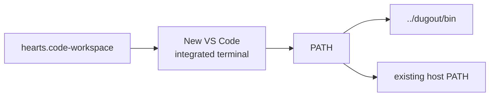
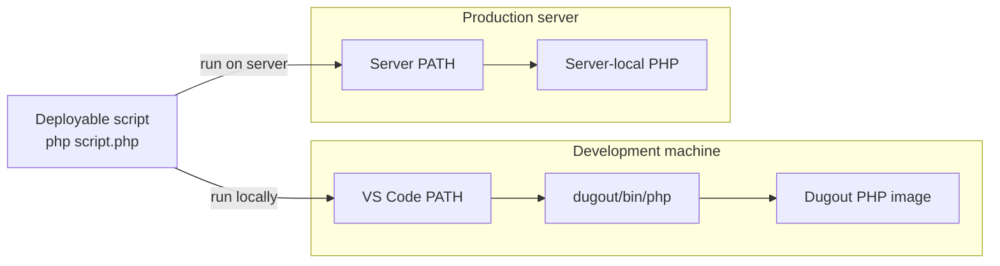

# Project and workspace integration

## Hearts integration contract

Hearts needs exactly one development integration file:

```text
hearts.code-workspace
```

It does not need copied shims, a runner, an `.env`, or a required
`.dugout/tool-versions` file. Those belong to Dugout.

For another repository, follow the
[new-project quick start](10-new-project-quickstart.md). Adding the workspace
entry is always a manual review and edit. No Dugout installation command
rewrites project or editor files.



The workspace names both roots and prepends Dugout's `bin` directory:

```jsonc
{
  "folders": [
    {
      "name": "hearts",
      "path": "."
    },
    {
      "name": "dugout",
      "path": "../dugout"
    }
  ],
  "settings": {
    "terminal.integrated.env.linux": {
      "PATH": "${workspaceFolder:dugout}/bin:${env:PATH}"
    },
    "terminal.integrated.env.osx": {
      "PATH": "${workspaceFolder:dugout}/bin:${env:PATH}"
    }
  }
}
```

`${workspaceFolder:dugout}` refers to the explicitly named multi-root folder.
This is more stable than embedding an absolute machine path.

## Activation scope

The setting affects terminals created after the workspace opens:

- close or dispose of old integrated terminals after changing the setting;
- create a new terminal;
- commands in that terminal and its child processes inherit the modified
  `PATH`;
- terminals outside VS Code keep their original `PATH`;
- production receives neither the workspace file's environment nor Dugout.

It does not:

- replace host binaries;
- modify shell startup files;
- change Docker Compose;
- expose ports;
- mount all workspace folders into a tool container;
- guarantee that editor extensions inherit terminal settings.

## Verification

From a newly created Hearts terminal:

```sh
command -v php
command -v composer
command -v node
command -v npm
command -v npx
```

Expected paths end with:

```text
/dugout/bin/php
/dugout/bin/composer
/dugout/bin/node
/dugout/bin/npm
/dugout/bin/npx
```

Then verify resolution and execution:

```sh
dug list
dug which php
php --version
composer --version
node --version
npm --version
npx --version
```

From a nested directory:

```sh
cd frontend
node -e 'console.log(process.cwd())'
```

The printed path should be `/workspace/frontend`.

## Interactive commands, scripts, and Make

This mechanism uses real executable shims, not aliases. Consequently, it
applies to:

- commands typed at the prompt;
- POSIX shell scripts launched from that terminal;
- Make recipes;
- subprocesses that inherit `PATH`;
- package lifecycle scripts that invoke another shimmed command.

Example shell script:

```sh
#!/bin/sh
set -eu

php scripts/check.php
npm --prefix frontend run typecheck
```

Example Make recipe:

<!-- markdownlint-disable MD010 -->

```make
.PHONY: versions
versions:
	php --version
	node --version
```

<!-- markdownlint-enable MD010 -->

Neither example mentions Dugout. On the development machine the workspace
`PATH` intercepts the names. On production the server's normal `PATH` resolves
its provisioned binaries.

Avoid absolute host paths in arguments passed to a containerized tool. Prefer:

```sh
php scripts/check.php
```

over:

```sh
php /home/developer/Code/hearts/scripts/check.php
```

The project is mounted at `/workspace`, not at its host absolute path.

## Production boundary

Dugout is completely absent from production:



The production server has:

- no Dugout checkout;
- no `dug` runner;
- no Dugout shims;
- no Dugout `.env`;
- no Dugout tool images;
- no `moznet`;
- no VS Code workspace environment.

Deployable scripts must therefore use ordinary command names. Do not put
either form below in application scripts or production Make targets:

```sh
dug tool php script.php
../dugout/bin/php script.php
```

Hearts' deployment workflow uses an explicit source allowlist and does not
copy `hearts.code-workspace`. The workspace file is inert editor
configuration, not application runtime configuration.

## Optional ordinary-terminal activation

The current Hearts design intentionally limits automatic activation to VS
Code. For a separate terminal, a developer can opt in for that shell:

```sh
export PATH="/home/mozrin/Code/dugout/bin:$PATH"
```

This should remain explicit. Dugout does not rewrite `.profile`, `.bashrc`,
`.zshrc`, or system paths.

## Editor extensions

Terminal interception does not prove that a PHP, JavaScript, or language-server
extension uses the same executable. Extensions may bypass terminal
environment settings or require a persistent process.

Treat each editor extension as a separate integration:

- inspect whether it accepts a custom executable path;
- point it at the appropriate `dugout/bin` shim only after testing;
- verify diagnostics contain project-relative paths;
- avoid claiming support based solely on terminal behavior.

One-shot containers fit formatters, generators, tests, and builds well.
Persistent language servers may need a different lifecycle.

## Troubleshooting

### A host tool still runs

```sh
command -v php
printf '%s\n' "$PATH"
```

Open the `.code-workspace` file, not only the Hearts folder, then create a new
integrated terminal. Confirm the sibling Dugout folder exists at
`../dugout`.

### The shim is selected but Docker fails

```sh
dug doctor
docker info
```

Start Docker. If PHP reports that `moznet` is absent, start or repair Dugout's
service plane; the runner deliberately does not create external networks.

### The wrong version runs

```sh
dug list
dug which php
sed -n '1,120p' ../dugout/.env
```

Change the Dugout `.env`, rebuild or pull the selected image, and run
`dug verify`.

### A command works at the prompt but not in an extension

The extension probably does not inherit integrated-terminal settings. Configure
and test its executable separately.

### A production command cannot find PHP or Node.js

That is a production-provisioning issue. Do not install Dugout on the server.
Install or repair the required server-local runtime and its `PATH`.
