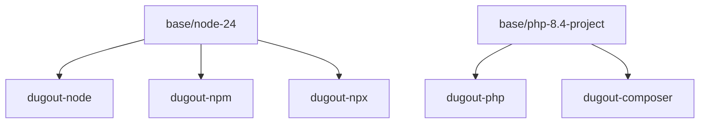
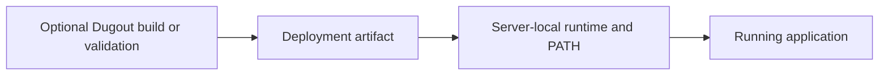

# Build, test, and publish

## Repository layout

The root Compose file defines the service plane, while service-specific bind
mounts are grouped under `services/`. Tool implementation remains visibly
separate:

```text
dugout/
├── bin/
│   └── dug
├── docs/
├── services/
│   ├── adminer/
│   ├── dozzle/
│   ├── mailpit/
│   ├── nginx-proxy-manager/
│   │   ├── backups/        # ignored, machine-local
│   │   ├── config/         # ignored runtime bind mount
│   │   └── logs/           # ignored runtime bind mount
│   ├── pihole/
│   └── portainer/
├── share/
│   └── dugout/
├── tests/
│   ├── check-shell.sh
│   ├── test-images.sh
│   └── test-runner.sh
├── tools/
│   ├── node/
│   └── php/
└── docker-compose.yaml
```

The `services/` runtime subdirectories are intentionally ignored. Compose
creates bind-mount directories when needed, and named volumes hold persistent
application state. Private backups belong under the relevant service's
`backups/` directory and must never be committed.

## Future tool metadata

The current catalog is `share/dugout/catalog`. A future catalog format may
carry richer machine-readable metadata:

```yaml
name: php
image: dugout-php
entrypoint: php
version: 8.4.12
platforms:
  - linux/amd64
  - linux/arm64
workspace: writable
network: none
cache: null
docker_api: false
```

The runner should consume a generated, validated catalog rather than parsing
arbitrary Dockerfiles.

Metadata schema changes require a schema version and compatibility policy.

## Shared bases without shared interfaces

Independent public images may share layers:



Each final image retains one entrypoint. Multi-stage Dockerfiles or Buildx Bake
targets can avoid duplicated source definitions.

## Local build commands

The implemented Make targets are:

```sh
make build-tools
make build-php
make build-composer
make build-node
make build-npm
make build-npx
make test
```

Version overrides use Make variables:

```sh
PHP_VERSION=8.5 make build-php
NODE_VERSION=24 NPM_VERSION=11 make build-node build-npm build-npx
```

Commands must produce the exact image reference they built and must not
overwrite a stable published tag during local development.

Build orchestration through `dug` is not implemented; the runner executes
tools and deliberately does not build or publish images.

## Contract-test suite

Every image receives the same baseline tests.

### Identity

```sh
tool --version
```

Assert the selected upstream version, image metadata, and architecture.

### Arguments

Test:

- spaces;
- quotes;
- Unicode;
- empty arguments;
- arguments beginning with `-`;
- multiple files;
- paths relative to a nested working directory.

### Standard input/output

Test:

- piped standard input;
- stdout capture;
- stderr capture;
- no forced ANSI color in non-TTY mode;
- TTY color/interactive behavior where appropriate.

### Exit status

Run known success and failure cases. The status observed by the host must match
the tool.

### Signals

Start an interruptible command, send `SIGINT`, and verify prompt termination
without orphan processes.

### Ownership

Run as a non-root numeric UID/GID, create a file in `/workspace`, and verify
host ownership.

### Working directory

Invoke from a nested fixture directory and ensure both `pwd` and relative file
access behave as expected.

### Filesystem

For read-only tools, verify writes fail. For writable tools, verify writes are
limited to the workspace, explicit cache, and temporary filesystem.

### Network

Verify:

- `none` tools cannot reach the network;
- internet tools can complete an expected registry operation in integration
  tests;
- `moznet` tools fail clearly when the network is absent;
- no tool publishes a port;
- no ordinary tool sees the Docker socket.

### Architecture

At minimum, test native `linux/amd64`. If `linux/arm64` is published, run native
or emulated smoke tests and clearly distinguish the confidence level.

## Runner test suite

The runner needs tests independent of any particular tool:

- manifest discovery;
- nested directory translation;
- spaces in workspace paths;
- missing Docker;
- Docker daemon unavailable;
- missing manifest;
- missing tool selection;
- invalid manifest syntax;
- duplicate entries;
- unknown policy;
- lock mismatch;
- missing image;
- pull failure;
- UID/GID mapping;
- TTY detection;
- exit-code forwarding;
- signal forwarding;
- cache-name validation;
- `moznet` presence and absence;
- environment allowlisting;
- secret redaction;
- refusal to mount the Docker socket without policy;
- refusal to publish ports;
- no host fallback.

A fake Docker executable can test argument construction. Separate integration
tests should exercise a real daemon.

## End-to-end project fixture

Maintain a small fixture repository:

```text
tests/fixtures/project/
├── .dugout/
├── nested/directory/
├── composer.json
├── package.json
└── scripts/
```

End-to-end tests activate its shims and verify:

```sh
php --version
composer --version
node --version
npm --version
npx --version
```

They should also prove:

- host tools are not selected;
- package-manager caches persist;
- generated files have correct ownership;
- lock resolution uses the expected digest;
- a command from `nested/directory` sees the correct container directory.

## Production-independence tests

Dugout may be used during development and optionally in CI, but it must never
be a production runtime dependency.

Maintain a deployment-artifact test that:

1. creates the same artifact sent to the server;
2. confirms `.vscode/` and workspace files are absent when the packaging model
   supports exclusions;
3. removes `dugout/bin` from `PATH`;
4. makes `dug` unavailable;
5. scans deployable scripts, Make targets, hooks, and service definitions for
   direct `dug` or `dugout/bin` references;
6. executes representative scripts using provisioned local tools;
7. verifies no production Compose/network definition references `moznet`.

An optional CI job can execute Dugout images to build or validate the artifact.
The resulting artifact and server runtime must not require those images.



There is deliberately no runtime edge from Dugout to the server or running
application.

## Publishing pipeline

For each tool release:

1. resolve and verify the upstream release;
2. build each supported architecture;
3. run image contract tests;
4. run vulnerability scanning;
5. generate an SBOM;
6. publish an immutable commit tag;
7. publish the exact tool-version tag;
8. assemble the multi-platform manifest;
9. optionally sign the digest;
10. update release metadata;
11. test pulling and running the published digest;
12. announce compatibility or breaking changes.

Do not publish a moving major/minor tag until the immutable release has passed
post-publish verification.

## Multi-platform policy

Initial support should be explicit:

```text
linux/amd64: required
linux/arm64: desired where upstream supports it
```

Do not publish an architecture in a manifest merely because the Dockerfile
builds. The tool must run its smoke tests on that architecture.

Docker Buildx/Bake can share build definitions and publish multi-platform
manifests. Native runners are preferable for runtime-heavy tools; emulation is
acceptable for limited smoke tests when documented.

## Tagging and locking

Tag movement:

| Tag | Mutable | Intended use |
| --- | ---: | --- |
| Digest | No | Project lock and reproducible execution |
| Exact version | Should not move after publication | Normal project selection |
| Minor channel | Yes | Opt-in update stream |
| Major channel | Yes | Exploration |
| `edge` | Yes | Dugout development only |
| `latest` | Avoid for projects | Human convenience, if published at all |

If an exact tag must be rebuilt for a critical base-image fix, publish a
Dugout revision tag such as:

```text
8.4.12-dugout.2
```

Do not silently repoint an allegedly immutable exact release.

## Dependency updates

Automate discovery but keep publication reviewed:

- base-image digest updates;
- upstream tool releases;
- GitHub Actions updates;
- vulnerability database findings.

An update PR should show:

- old and new tool versions;
- old and new base digests;
- image size change;
- SBOM/package diff where practical;
- contract-test results;
- known breaking changes.

## Image size budgets

Track compressed and unpacked size over time. Suggested policy:

- define a baseline per tool family;
- fail or warn on unexplained growth beyond a percentage threshold;
- keep build-only dependencies out of final stages;
- clean package-manager indexes in the same layer;
- avoid copying caches into images;
- never trade runtime compatibility for a cosmetic size reduction.


## CI permissions

Build workflows should begin with least privilege:

```yaml
permissions:
  contents: read
  packages: write
  id-token: write
```

Grant only what the chosen registry and signing workflow needs. Pull requests
from untrusted contexts must not receive publish credentials.

## Release checklist

- [ ] Metadata schema valid
- [ ] Upstream version verified
- [ ] Base digest pinned
- [ ] License compatible
- [ ] Contract tests pass
- [ ] Runner integration passes
- [ ] Non-root invocation passes
- [ ] No ports published
- [ ] Network policy tested
- [ ] Cache behavior tested
- [ ] Supported architectures tested
- [ ] Vulnerability results reviewed
- [ ] SBOM generated
- [ ] Exact tag published
- [ ] Digest recorded
- [ ] Published image smoke-tested
- [ ] Documentation updated
- [ ] Deployment artifact has no Dugout runtime dependency

## Source references

- [Dockerfile reference](https://docs.docker.com/reference/dockerfile/)
- [Docker Build GitHub Actions](https://docs.docker.com/build/ci/github-actions/)
- [Docker multi-platform builds with GitHub Actions](https://docs.docker.com/build/ci/github-actions/multi-platform/)
