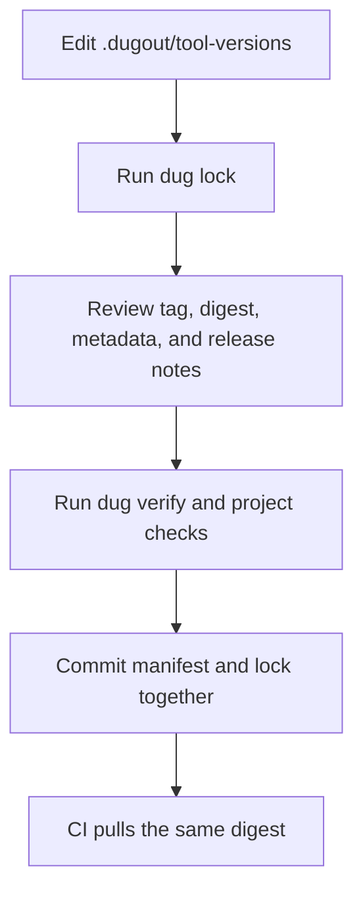

# Rollout and operations

## Principle

Deliver the smallest complete vertical slice before publishing a large tool
catalog. The runner is the product; images are replaceable implementations
behind its contract.

```mermaid
flowchart LR
    contract["Document contracts"]
    prototype["Prototype runner"]
    smallTools["Prove with jq, ShellCheck, and shfmt"]
    project["Adopt in one project"]
    languages["Add PHP, Node families"]
    lock["Add digest locking"]
    publish["Automate build and publication"]
    expand["Expand catalog from real demand"]

    contract --> prototype --> smallTools --> project
    project --> languages --> lock --> publish --> expand
```



## Phase 0: decisions

Resolve these choices before implementation:

- registry and canonical image naming;
- supported host operating systems;
- first supported CPU architectures;
- runner implementation language;
- runner installation location and update strategy;
- manifest and lock schemas;
- default network policies;
- cache backend and naming;
- initial PHP, Node runtime families;
- whether exact version tags are immutable;
- signing and SBOM expectations.

Record decisions as short architecture decision records under `docs/decisions/`
if they are difficult to reverse.

## Phase 1: runner skeleton

Implement:

- `dug doctor`;
- project-root discovery;
- manifest parsing;
- image resolution;
- safe Docker argument construction;
- relative working-directory translation;
- UID/GID handling;
- TTY detection;
- exit-code forwarding;
- minimal project shim generation.

Use a fake Docker executable for fast unit tests and one tiny real image for
integration.

Exit criteria:

- arguments containing spaces and quotes survive;
- nested working directories work;
- host fallback is impossible;
- missing Docker and missing manifests produce actionable errors;
- the runner does not require `moznet` for offline tools.

## Phase 2: low-risk tools

Publish:

- `jq`;
- `shellcheck`;
- `shfmt`.

Use them to prove:

- standard input;
- stdout/stderr;
- read-only workspace mounting;
- optional write access;
- exit-code propagation;
- version locking;
- multi-architecture build mechanics.

Do not start with Composer or npm. Package managers combine internet access,
caches, credentials, writable workspaces, lifecycle scripts, and native
artifacts; they are poor tools for debugging the runner's fundamentals.

## Phase 3: first project adoption

Choose one active application project. Add Dugout as a named workspace
folder and manually prepend its shared `bin` directory to the integrated
terminal `PATH`.

```text
project.code-workspace
```

Do not copy shims into the application project. A version manifest is optional
and should be added only when the project intentionally differs from machine defaults.

Start with the low-risk shims. Verify behavior:

```sh
command -v jq
command -v shellcheck
dug which shellcheck
shellcheck scripts/*.sh
```

Test:

- VS Code integrated terminal;
- an ordinary terminal with `direnv`;
- Make targets;
- non-interactive command execution;
- a workspace path containing spaces in the test fixture;
- branch switching when an optional manifest changes;
- a deployment-like shell with Dugout removed from `PATH`, using independently
  installed local tools.

## Phase 4: PHP family

Add PHP first, then Composer.

### PHP acceptance

- expected version and extensions;
- local script execution;
- piped PHP source;
- nested working directory;
- correct file ownership;
- no network by default;
- no published ports.

### Composer acceptance

- cache persistence;
- registry/network access;
- optional authentication;
- `composer install`;
- `composer update` in a disposable fixture;
- scripts and plugin policy;
- comparison with project API runtime;
- correct ownership of `vendor/` and lock files.

Do not migrate a project's dependency updates until runtime compatibility is
documented.

## Phase 5: Node family

Build a shared Node base and publish `node`, `npm`, and `npx` entrypoint images.

Acceptance:

- exact Node/npm/npx versions;
- npm cache persistence;
- lifecycle scripts;
- package-lock stability;
- native-module compatibility with the frontend runtime;
- correct ownership of `node_modules` and lock files;
- npx uses the intended project and cache behavior;
- non-interactive CI output remains clean.

Before locking and publication automation, the current implementation also

## Phase 6: locking and upgrades

Add:

```sh
dug lock
dug verify
dug pull
dug update
```

Suggested update workflow:



The runner must detect:

- manifest changed without lock update;
- lock entry names a different tag;
- digest unavailable for the host architecture;
- an image violates runner/catalog compatibility.

## Phase 7: catalog expansion

Add tools from demonstrated demand. Recommended next set:

- `yq`;
- `hadolint`;
- `actionlint`;
- `mariadb`;
- `redis-cli`;
- `curl`;
- `gh`;
- API linting/generation tools.

Every proposal follows the checklist in
[Initial tool catalog](05-tool-catalog.md).

## Project initialization

Project adoption is intentionally manual. Follow the
[optional workspace-inclusion guide](10-optional-workspace-inclusion.md).

No `dug init` command rewrites editor or project files. A developer reviews
the existing workspace, merges the named Dugout folder and terminal `PATH`
setting, then verifies the result. This protects arbitrary user-owned folders,
settings, tasks, extensions, and comments already in that file.

## Daily operation

Typical developer flow:

```sh
cd project
dug doctor
php --version
composer install
npm install
make test
```

Ordinary commands remain ordinary. The runner should be visible when
inspection is needed:

```sh
dug which php
dug image php
dug cache list
dug network check
```

## Starting and stopping Dugout

Tool containers do not need long-running startup. They require only Docker and
the selected image.

Tools with `moznet` policy additionally require the Dugout platform network:

```sh
dug network check
```

The existing Dugout operating procedure owns creation and startup of the
service plane. The runner never starts all Dugout services merely because a
database client was invoked.

## Offline behavior

After images are pulled:

- `none` tools should work offline;
- internet tools may work when their required packages are already in cache;
- missing images must produce a clear pull requirement;
- a lock digest should remain usable from the local image store;
- the runner should offer a prefetch command for travel or unreliable
  connectivity.

Proposed:

```sh
dug pull --all
dug doctor --offline
```

## Upgrade policy

### Runner

The runner has a semantic version. Project manifests may declare a minimum
compatible runner schema/version.

Breaking runner changes require:

- migration notes;
- compatibility errors rather than undefined behavior;
- a transition window where practical;
- a project-update command.

### Images

Image updates are project decisions. Dugout can report availability without
silently changing locks:

```sh
dug outdated
```

Suggested output:

```text
TOOL      CURRENT   AVAILABLE   LOCKED
php       8.4.12    8.4.13      yes
composer  2.8.10    2.8.11      yes
node      24.5.0    24.6.0      yes
```

## Rollback

Rollback is a Git operation:

1. restore the prior `tool-versions` and lock file;
2. run `dug verify`;
3. pull the old digest if absent;
4. rerun the failing command.

Do not delete old exact-version images immediately after a new release.
Registry retention must support practical project rollback.

If the runner itself regresses, retain an install mechanism for a previous
runner release.

## Troubleshooting

### Docker is unavailable

Symptoms:

```text
dug: Docker CLI not found
```

or:

```text
dug: cannot reach the Docker daemon
```

Actions:

```sh
docker version
docker info
dug doctor
```

### Tool shim is not selected

```sh
type -a php
printf '%s\n' "$PATH"
```

Create a new editor terminal or approve/reload `direnv`.

### Image cannot be pulled

```sh
dug image php
docker login <registry>
dug pull php
```

The runner must distinguish authentication failure, missing tag, unsupported
architecture, and network failure.

### Files are owned by root

```sh
id
ls -ln affected-file
dug doctor
```

Stop using the affected image until its numeric UID/GID contract is fixed.
Do not normalize root ownership as expected behavior.

### Composer resolves the wrong platform

Compare:

```sh
php --version
php -m
composer check-platform-reqs
docker compose run --rm api php --version
docker compose run --rm api php -m
```

Select a Composer image matching the project runtime or run Composer through
the application image.

### Native Node module fails

Compare Node version, architecture, libc, and image base between the npm tool
and frontend runtime. Clear only the relevant cache and rebuild
`node_modules` after correcting the mismatch.

### `moznet` is missing

```sh
docker network inspect moznet
dug network check
```

Start or repair Dugout. Do not create an incidental replacement network from
the tool runner:

```sh
cd /path/to/dugout
make services-up
```

### Tool needs a credential

Use the documented narrow credential policy for that tool. Do not solve the
problem by mounting the entire home directory or forwarding every environment
variable.

## Removing Dugout from a project

Removal should be reversible:

1. remove `dugout/bin` from workspace and shell `PATH`;
2. remove or archive an optional project manifest and lock;
3. replace explicit `dug tool` automation calls;
4. verify host or alternative toolchain commands;
5. delete project-specific cache volumes only after confirming they are not
   shared.

Removing project integration does not stop Dugout services and does not delete
`moznet`.

## Operational success criteria

The system is ready for broad adoption when:

- a new project can be initialized predictably;
- ordinary commands select project tools in editor and shell environments;
- host fallback is detectable and prohibited;
- PHP/Composer, Node/npm runtime parity is documented;
- files have correct ownership;
- cache cleanup is safe;
- offline and locked execution are understood;
- `moznet` ownership remains with Dugout;
- no tool publishes ports;
- CI consumes the same image digests;
- rollback has been exercised, not merely described.
- production servers contain no Dugout runner, shims, tool images, or
  `moznet`;
- deployable scripts resolve server-local tools through the server's `PATH`.
