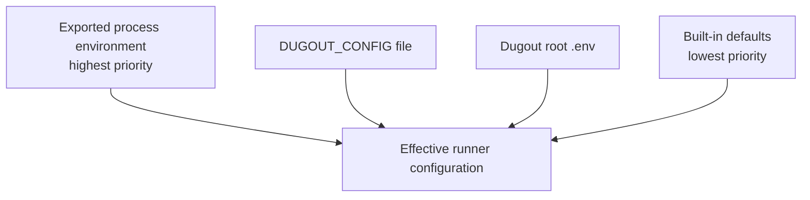

# Configuration reference

## Files

Dugout ships two root configuration files:

| File | Git status | Purpose |
| --- | --- | --- |
| `.env.example` | Committed | Complete template and configuration contract |
| `.env` | Ignored | This development machine's active values |

Initialize the checkout with:

```sh
cp .env.example .env
```

The copied `.env` is ignored, so changing versions, ports, or service switches
does not create Git noise or publish machine-specific values.

Do not put registry tokens, application credentials, SSH keys, or production
secrets in it.

## Syntax and safety

The parser accepts:

```text
KEY=value
# full-line comment
```

Rules:

- keys contain uppercase letters, digits, and underscores;
- only documented keys are accepted;
- values are unquoted literal text;
- blank lines and full-line comments are ignored;
- whitespace is significant and should not surround `=`;
- shell expansion, command substitution, interpolation, and inline comments
  are not performed;
- malformed lines and unknown keys fail closed.

For example, this is literal text and is never executed:

```text
DUGOUT_IMAGE_PREFIX=$(untrusted-command)
```

It will subsequently fail image-prefix validation.

## Loading and precedence



More precisely:

1. Existing exported `DUGOUT_*` variables win.
2. If `DUGOUT_CONFIG` names a file, that file is read.
3. Otherwise, the root `.env` beside the Dugout source checkout is selected.
4. Missing values receive built-in defaults.

`DUGOUT_CONFIG` itself is an environment selector and is not read from `.env`.

One-call example:

```sh
DUGOUT_NODE_VERSION=24 node --version
```

Alternate configuration example:

```sh
DUGOUT_CONFIG="$PWD/config/test-tools.env" dug verify
```

## Image settings

### `DUGOUT_IMAGE_PREFIX`

Default:

```text
moztopia/dugout
```

Image names append `-<tool>:<tag>`:

```text
moztopia/dugout-php:8.4
```

Use a registry-qualified prefix when images are published:

```text
ghcr.io/moztopia/dugout
```

### Version components

| Key | Default | Affects |
| --- | --- | --- |
| `DUGOUT_PHP_VERSION` | `8.4` | PHP tag and Composer runtime suffix |
| `DUGOUT_COMPOSER_VERSION` | `2` | Composer tag |
| `DUGOUT_NODE_VERSION` | `22` | Node tag and npm/npx runtime suffix |
| `DUGOUT_NPM_VERSION` | `10` | npm and npx tags |

Derived tags:

```text
php       8.4
composer  2-php84
node      22
npm       10-node22
npx       10-node22
```

After changing a version, build or pull the matching image:

```sh
make build-tools
./bin/dug verify
```

## Network settings

| Key | Default |
| --- | --- |
| `DUGOUT_PHP_NETWORK` | `moznet` |
| `DUGOUT_COMPOSER_NETWORK` | `bridge` |
| `DUGOUT_NODE_NETWORK` | `none` |
| `DUGOUT_NPM_NETWORK` | `bridge` |
| `DUGOUT_NPX_NETWORK` | `bridge` |

Allowed values:

- `none`;
- `bridge`;
- `moznet`.

The `moznet` policy always maps to the Docker network named exactly `moznet`.
The name is a platform invariant and is not configurable because application
Compose projects consume that exact external network.

The runner inspects `moznet` before a `moznet` invocation. It never creates
the network and never publishes a port; `make up` creates it.

## Advanced settings

## Utility settings

Each utility has a `DUGOUT_<SERVICE>_ENABLED` setting. Use `1` to run it or `0`
to disable it, then run `make up` to reconcile the stack. The defaults enable
Portainer, Adminer, Mailpit, and Dozzle.

The `DUGOUT_<SERVICE>_PORT` settings publish each web interface on
`127.0.0.1`. Mailpit has separate `SMTP_PORT` and `HTTP_PORT` settings. Change
a port when its default is already occupied. Dugout does not use a reverse
proxy or an external proxy network.

### `DUGOUT_CACHE_HOME`

Overrides the host cache base for Composer, npm/npx.
Default:

```text
${XDG_CACHE_HOME:-$HOME/.cache}/dugout
```

The runner creates version-separated children such as:

```text
composer-2-php84
npm-10-node22
```

Use an absolute path. This directory is mounted only for tools whose catalog
policy declares a cache.

### `DUGOUT_DOCKER`

Selects the Docker CLI executable. Default:

```text
docker
```

An absolute path is useful when the preferred CLI is not on the activated
terminal's normal `PATH`:

```text
DUGOUT_DOCKER=/usr/bin/docker
```

This selects an executable; it is not a shell command string.

### `DUGOUT_PROJECT_ROOT`

Overrides automatic project discovery for every invocation using that
configuration. The current directory must still be inside the selected root.

Use this sparingly. Git-root discovery is safer for normal project work. A
machine-wide value can accidentally mount the wrong amount of source into tool
containers.

shim. Set this absolute path when automatic discovery is ambiguous:

```text
```

This host SDK is for editor metadata and optional device execution. Android
command-line builds continue using Dugout's containerized SDK.

### `DUGOUT_CATALOG`

Selects an alternate trusted catalog file. The default is:

```text
dugout/share/dugout/catalog
```

The catalog controls tool names, baseline networks, workspace access, and
cache classes. Treat an alternate catalog as executable security policy even
though its format is data-only.

## Build integration

Maintainers can use explicit Make variables for one-off development builds:

```sh
make build-tools
PHP_VERSION=8.5 make build-php
```

The runner uses its effective `DUGOUT_*` configuration when selecting images,
so keep a one-off build's tag aligned with the runner before invoking it.

## Repository-local setup

There is no installation step. Copy `.env.example` to `.env`, review the
service switches and ports, and run `make up`.

The shims remain in the Dugout checkout and are enabled only by VS Code
workspace settings. Installation deliberately does not:

- search for application projects;
- create or modify a `.code-workspace` file;
- alter a shell profile or global `PATH`;
- copy commands into `~/.local/bin`;
- add `.dugout` files to a project.

`make down` removes containers and the network while preserving named volumes.
Use `docker compose down --volumes` only when you also intend to delete
persistent utility data.

## Change checklist

After editing `.env`:

1. run `make build-tools` or pull the selected images;
2. run `./bin/dug list`;
3. run `./bin/dug verify`;
4. run `./bin/dug doctor`;
5. create a new VS Code terminal only if the workspace `PATH` itself changed;
6. test a tool from both the project root and a nested directory.
