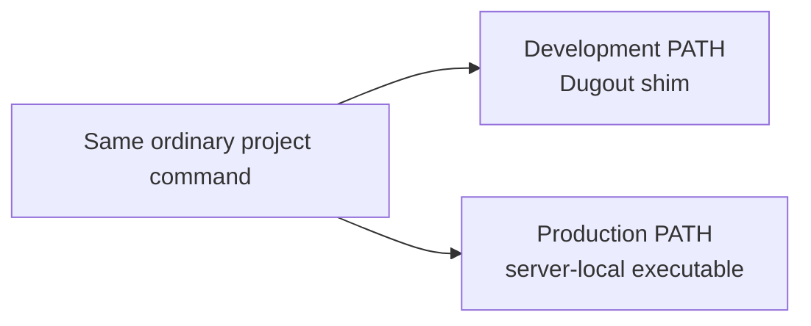

# Optional multi-root workspace inclusion

No application repository requires Dugout. This optional guide includes the
Dugout checkout in a multi-root VS Code workspace when that is convenient,
without copying Dugout files into the application or creating a production
dependency.

## Safety rule

Workspace integration is always manual.

Neither `make install` nor any build command will create, parse, or rewrite:

- a project's `.code-workspace` file;
- `.vscode/settings.json`;
- project scripts or Makefiles;
- shell startup files;
- production deployment configuration.

A workspace may contain arbitrary user-owned folders, settings, tasks,
extensions, comments, or platform details. Automatic merging would risk
discarding or changing unrelated configuration.

## Prerequisites

- Docker is installed and the daemon is running.
- Dugout is checked out on the development machine.
- Dugout's `.env` has the desired machine defaults.
- Required tool images have been built or pulled.
- The project is a Git repository, or `DUGOUT_PROJECT_ROOT` will be configured
  deliberately.
- Dugout services have been started so `moznet` exists before running a tool
  whose policy uses it.

Validate Dugout first:

```sh
cd /path/to/dugout
make install
./bin/dug doctor
```

## Recommended directory layout

Sibling checkouts produce a portable relative workspace:

```text
Code/
├── dugout/
│   ├── bin/
│   └── .env
└── new-project/
    └── new-project.code-workspace
```

Dugout does not require this layout, but the workspace `path` must accurately
locate it.

## Step 1: inspect the existing workspace

Open the project's current `.code-workspace` file in an editor. Read the entire
`folders` and `settings` objects before editing.

If the project has no workspace file, create one manually with a name chosen
for that project:

```jsonc
{
  "folders": [
    {
      "name": "new-project",
      "path": "."
    }
  ],
  "settings": {}
}
```

Do not replace an existing file with this example.

## Step 2: add the Dugout workspace folder manually

Merge this object into the existing `folders` array:

```jsonc
{
  "name": "dugout",
  "path": "../dugout"
}
```

Adjust the relative path if the repositories are not siblings. Preserve every
existing folder entry.

The name `dugout` is part of the variable reference used in the next step. If
that name is already taken, choose another unique folder name and use the same
name inside `${workspaceFolder:...}`.

## Step 3: prepend the shim directory manually

Merge these properties into the existing `settings` object:

```jsonc
{
  "terminal.integrated.env.linux": {
    "PATH": "${workspaceFolder:dugout}/bin:${env:PATH}"
  },
  "terminal.integrated.env.osx": {
    "PATH": "${workspaceFolder:dugout}/bin:${env:PATH}"
  }
}
```

If either platform object already exists, add or update only its `PATH`
property and preserve its other environment variables.

Do not use a project-local `.dugout/bin` path. The shared shims live in the
Dugout checkout.

## Complete example

This is a minimal result, not a replacement template:

```jsonc
{
  "folders": [
    {
      "name": "new-project",
      "path": "."
    },
    {
      "name": "dugout",
      "path": "../dugout"
    }
  ],
  "settings": {
    "terminal.integrated.env.linux": {
      "PATH": "${workspaceFolder:dugout}/bin:${env:PATH}"
    },
    "terminal.integrated.env.osx": {
      "PATH": "${workspaceFolder:dugout}/bin:${env:PATH}"
    }
  }
}
```

## Step 4: reopen and verify

Open the `.code-workspace` file in VS Code. Dispose of existing terminals and
create a new integrated terminal; existing processes cannot receive a changed
environment retroactively.

Check command selection:

```sh
command -v dug
command -v php
command -v composer
command -v node
command -v npm
command -v npx
command -v dart
command -v flutter
```

Every path should end in `dugout/bin/<command>`.

Check effective configuration and images:

```sh
dug list
dug verify
dug doctor
```

Check actual execution:

```sh
php --version
composer --version
node --version
npm --version
npx --version
dart --version
flutter --version
```

Check nested-directory mapping:

```sh
cd path/inside/the/project
node -e 'console.log(process.cwd())'
```

The result should begin with `/workspace`.

## Step 5: verify script inheritance

From the activated terminal:

```sh
sh -c 'command -v php && php --version'
```

This proves a child POSIX shell inherits the workspace `PATH`. Project scripts
that call ordinary `php`, `composer`, `node`, `npm`, `npx`, `dart`, or
`flutter` names receive the same interception.

Do not change deployable scripts to call `dug` explicitly. Their ordinary
command names are what allow server-local tools to take over in production.

## Optional per-project version overrides

Machine defaults from Dugout `.env` are usually enough. If a project genuinely
requires different tags, it may commit only:

```text
# .dugout/tool-versions
php 8.4
composer 2-php84
node 22
npm 10-node22
npx 10-node22
dart 3.12.2
flutter 3.44.2
```

This manifest is data, not a shim directory. Its location also becomes the
runner's project root. Every command the project uses must appear exactly once.

Do not add this file merely to duplicate the machine defaults.

## Production checklist

Before considering adoption complete, verify:

- the production server has no Dugout installation;
- deployment does not copy the Dugout checkout;
- the `.code-workspace` file is not treated as runtime configuration;
- deployable scripts contain no `dug tool` calls or `dugout/bin` paths;
- production provisioning owns its PHP, Node.js, and other required versions;
- production networks do not refer to local `moznet`;
- a normal server shell resolves server-local executables.



## Rollback

Rollback is also a manual workspace edit:

1. remove `dugout/bin` from the workspace terminal `PATH`;
2. optionally remove the Dugout folder entry if it has no other purpose;
3. dispose of integrated terminals and create a new one;
4. run `command -v php` and `command -v node` to confirm host resolution.

No project source, dependency file, Compose file, or production configuration
needs to change.

## Review checklist for workspace edits

Before saving:

- [ ] Existing workspace folders remain present.
- [ ] Existing settings, tasks, and extensions remain unchanged.
- [ ] The Dugout folder path is correct relative to the workspace file.
- [ ] The folder name matches `${workspaceFolder:dugout}`.
- [ ] The new path prepends rather than replaces `${env:PATH}`.
- [ ] No absolute developer-specific path was committed unnecessarily.
- [ ] No application script was changed to mention Dugout.
