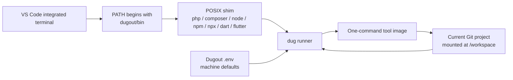

# Dugout documentation

Dugout is the local development platform shared by Moztopia projects. It has
two complementary responsibilities:

1. provide long-lived infrastructure such as DNS, reverse proxying,
   administration, and the shared `moznet` Docker network;
2. provide small, single-purpose tool images that projects invoke through
   ordinary command names.

The tool plane is implemented for PHP, Composer, Node.js, npm, npx, Dart, and
Flutter. Future tools should follow the same image, runner, security, and
documentation contracts.

Current release: **1.1.0 — Double**. See the
[release notes](../CHANGELOG.md).

## Current command model

The important ownership rule is that shims and machine defaults live in
Dugout. An application project does not copy them. A VS Code multi-root
workspace only places `dugout/bin` before the host's existing `PATH`.

## Design guarantees

- `php`, `composer`, `node`, `npm`, `npx`, `dart`, and `flutter` resolve to
  Dugout shims in an activated development terminal.
- Shims are small POSIX `sh` programs, forward every argument unchanged, and
  never fall back to host tools.
- Every tool image has one public command and one entrypoint.
- Machine defaults live in Dugout's ignored `.env`.
- An optional project `.dugout/tool-versions` file can pin image tags without
  copying shims.
- The caller's Git root is mounted at `/workspace`; a nested working directory
  is preserved.
- Files created in the project use the caller's numeric UID and GID.
- Containers are ephemeral, drop capabilities, and never publish ports.
  Their roots are read-only except for Flutter's disposable container layer,
  which its SDK requires for internal metadata.
- Network access is explicit per tool. Dugout Compose creates `moznet`; the
  runner only uses it when policy permits and never creates it.
- Production servers contain no Dugout repository, runner, shims, images,
  configuration, or `moznet`.
- Deployable scripts use ordinary command names. Development `PATH` selects
  Dugout; production `PATH` selects server-local tools.

## Documents

| Document | Purpose |
| --- | --- |
| [Platform architecture](01-platform-architecture.md) | Service plane, tool plane, ownership boundaries, and production separation |
| [Tool image contract](02-tool-image-contract.md) | Requirements for each single-purpose image |
| [Runner and command shims](03-runner-and-command-shims.md) | Exact command-resolution and container behavior |
| [Project and workspace integration](04-project-and-workspace-integration.md) | The one-file Hearts integration and script behavior |
| [Initial tool catalog](05-tool-catalog.md) | Tool policies, priorities, and compatibility concerns |
| [Security and networking](06-security-and-networking.md) | Least privilege, `moznet`, mounts, caches, and Docker access |
| [Build, test, and publish](07-build-test-and-publish.md) | Image builds, contract tests, CI, and releases |
| [Rollout and operations](08-rollout-and-operations.md) | Adoption, upgrades, troubleshooting, and rollback |
| [Configuration reference](09-configuration-reference.md) | Every supported `.env` key and its precedence |
| [New-project quick start](10-new-project-quickstart.md) | Safe, manual adoption for another project workspace |

## Implementation status

| Capability | Status |
| --- | --- |
| PHP and Composer images | Implemented |
| Node.js, npm, and npx images | Implemented |
| Dart and Flutter images | Implemented |
| Shared POSIX runner and command shims | Implemented |
| Root `.env` configuration | Implemented |
| Optional per-project version manifest | Implemented |
| Runner and image contract tests | Implemented |
| Dugout-managed `moznet` lifecycle | Implemented |
| Mailpit, Dozzle, and MinIO services | Implemented |
| Digest lock file and registry publication automation | Future |
| Native Windows wrappers | Future |
| Persistent editor language-server integration | Tool-specific future work |

## Vocabulary

**Dugout service**
: A long-running local infrastructure container managed by Dugout Compose,
  such as the proxy, Portainer, Adminer, Mailpit, Dozzle, or MinIO.

**Tool image**
: An immutable image whose public interface is one command.

**Tool container**
: A short-lived container created for one invocation and removed at exit.

**Runner**
: `dug`, the POSIX host-side program that builds a constrained `docker run`
  argument vector.

**Shim**
: A POSIX executable in `dugout/bin` named after its tool. It delegates to the
  runner so normal `PATH` lookup selects the container.

**Machine configuration**
: Dugout's ignored root `.env`, initialized from `.env.example`.

**Tool manifest**
: An optional application-project file at `.dugout/tool-versions` that
  overrides machine-default image tags.

## Non-goals

Dugout does not:

- replace application containers;
- run package managers as permanent services;
- publish tool-container ports;
- automatically join every tool to `moznet`;
- mount the Docker socket or the user's home directory;
- silently fall back to host language installations;
- require VS Code or a devcontainer;
- install or activate anything on production servers.
